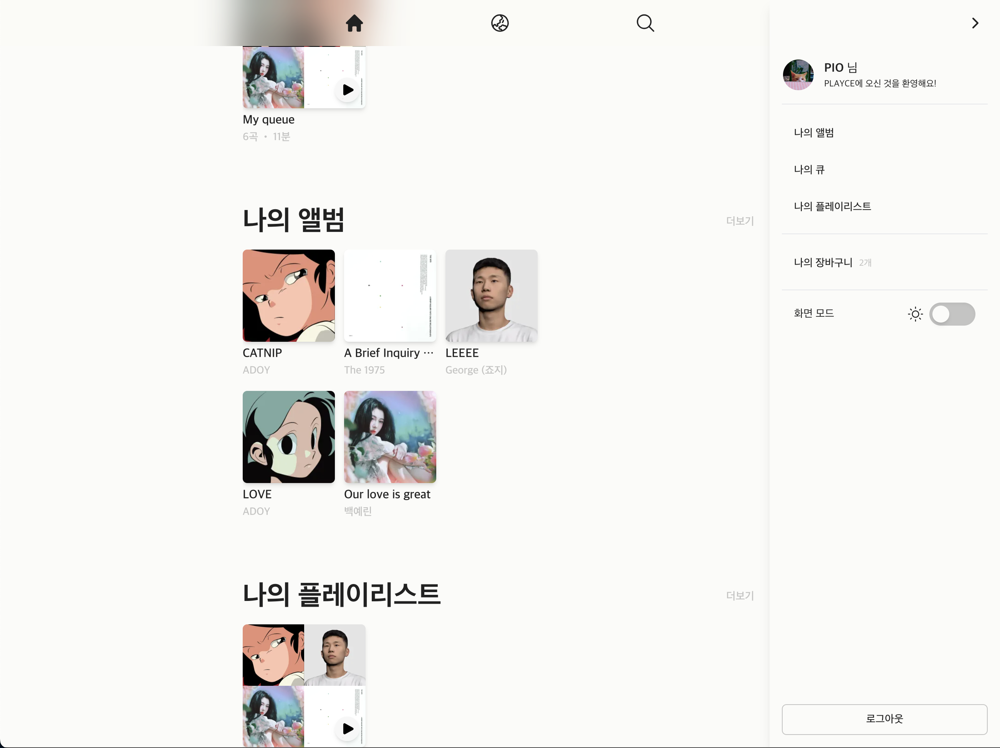

# PLAYCE

**playce**는 **_connect your pysical albums_** 라는 슬로건의 개념을 구현하기 위한
Front End 토이 프로젝트 입니다.  

우리의 공간 한 켠에 방치되어 있는 피지컬 앨범에 생명력을 불러 넣어줄 수 있는 방법이 없을까? 라는 의문에서 시작되었습니다.  

피지컬 앨범은 플레이어에 앨범을 교체해가며 듣기에 번거롭기도 하며, 스트리밍이라는 대체제로 인해 음원 청음이라는 기능이 퇴색 되어가고 있습니다. 단순히 수집, 이벤트 응모 등을 위한 수단으로 전락되고 있는 피지컬 앨범의 가치에 생명력을 불어 넣음으로써 공간을 단순히 차지하고 있는 것이 아닌, 공간에 음향을 더할 수 있도록 playce 프로젝트를 진행하고 있습니다.

 

**현실 세계에 존재하는 앨범의 가치를 더욱 빛내기 위해 다음과 같은 아이디어를 구현하기 위해 노력하고 있습니다.**

- 피지컬 앨범을 서비스에 등록하여 스트리밍
- 서비스에서 피지컬 앨범 구매 및 스트리밍
- 앨범 booklet과 같은 피지컬 앨범의 요소를 제공
- 뮤지션과의 리스너 간의 직접적인 연결 창구 제공 (서비스에서 음원 발매를 위한 크라우딩 펀딩, 커뮤니티 기능 제공)
- 사용자 간의 피지컬 앨범 판매/구매/교환 창구 제공 (소유권 및 스트리밍 권한 이전)

 
 

# 개발 스택

FrontEnd

- React, Zustand, TanstackQuery, wavesurfer.js, StyledComponents, TailwindCSS, FramerMotion

 

[BackEnd](https://github.com/OhWonJu/playce-backend)

- NestJS (구현을 위한 단순한 서버), Prisma

 
 

# MVP1 Released (2024-09-26)

개념 구현을 위한 가장 기본적인 기능 구현 완료

- HLS + M3U8 기반의 음원 스트리밍
- Flux 패턴 기반의 음원 재생 제어
- KakaoPay 를 통한 결제
- 앨범 트랙 기반 큐, 플레이리스 생성 및 트랙 추가/제거

 
 

# Deploy

[PLAYCE 체험하기](https://www.playce.kr/)
powered by AWS Amplify, EC2

 
 

# 사용 제한
- 일반적인 브라우저 외의(크롬, 사파리, 에지) 카카오 인앱 브라우저와 같은 환경에서는 구글 로그인이 제한됩니다. (구글 OAuth 정책)
- 토이 프로젝트 환경에서 Email을 통한 인증코드 전송과 같은 로직 구현이 제한되어 구글 로그인만 제공됩니다.

 
 

# 사용 가이드
- STEP1. 구글 OAuth 를 이용하여 PLAYCE 계정 생성하기
- STEP2. 앨범을 장바구니에 담기
- STEP3. 장바구니에서 앨범 구매하기 (with KakaoPay)
- STEP4. 구매한 앨범의 트랙들을 청음하기
- STEP5. 앨범의 트랙을 플레이리스트를 생성하여 플레이리스트에 추가하기, 큐에 추가하기

---

사용자 정보의 경우 비밀번호는 클라이언트 영역에서 SHA256 단방향 해싱을 합니다.
이를 통해 서버 및 DB 영역에서는 해싱된 데이터만을 사용합니다.

회원 탈퇴시 사용자와 관련된 데이터가 즉시 삭제됩니다.

| **Splash page**                           |                                         |
| ----------------------------------------- | --------------------------------------- |
|  |  |

 
 

| **Login modal**                            | 사용자 인증을 위해 현재 구글 로그인만 제공됩니다. |
| ------------------------------------------ | ------------------------------------------------- |
|  |           |

 
 

| **SignUp page**                           | 입력된 비밀번호는 클라이언트 영역에서 SHA 256 를 통해 암호화되므로 걱정하지마세요! |
| ----------------------------------------- | ---------------------------------------------------------------------------------- |
|  |                                             |

서버 및 DB 에서는 사용자의 원본 비밀번호를 전달받지 않습니다.

 
 

| **Home page**                           | 임의로 제공된 추천 앨범들을 구매하여 스트리밍 권한을 받아보세요! |
| --------------------------------------- | ---------------------------------------------------------------- |
|  |                                   |

 
 

| **My sidebar**                            |                                         |
| ----------------------------------------- | --------------------------------------- |
|  |  |

 
 

| **Cart modal**                          | 카카오페이를 통한 간편 결제를 제공합니다. |
| --------------------------------------- | ----------------------------------------- |
|  |      |

개발자 테스트 환경이므로 실제로 결제되는 것이 아니니 안심하세요!

 
 

| **Player**                                |                                         |
| ----------------------------------------- | --------------------------------------- |
|  |  |

음원의 Peak 데이터를 기반으로한 playbar 를 드레그하여 원하는 지점으로 음원의 재생을 조절해보세요.  
셔플, 한곡 반복 재생, 플레이리스트 반복 재생, 이전 트랙으로, 다음 트랙으로, 재생/정지 등을 조절해보세요.  

 
 

| **Player-queuing**                         | 앨범 혹은 플레이리스트 재생 중 간단한 스윕 제스쳐로 큐에 트랙을 추가해보세요! |
| ------------------------------------------ | ----------------------------------------------------------------------------- |
|  |                                           |

현재 재생중인 앨범 트랙 리스트 혹은 플레이리스트의 트랙 리스트의 아이템을 오른쪽으로 가볍게 스윕 해보세요.  
해당 트랙이 큐에 추가 됩니다!  
큐는 트랙을 보다 간단하고 직관적으로 추가하고 제거할 수 있는 플레이리스트 입니다.  

 
 

| **Player-delete**                          | 큐, 플레이리스트에서 간단한 스윕 제스처를 통해 트랙을 제거해보세요! |
| ------------------------------------------ | ------------------------------------------------------------------- |
|  |                             |

큐, 플레이리스트의 트랙 아이템을 왼쪽으로 가볍게 스윕 해보세요.  
해당 큐, 플레이리스트에서 트랙을 제거하는 버튼이 나타납니다!  

 
 

| **Playlist modal**                                 | 여러 상황, 취향에 맞는 곡들을 별도의 플레이리스트에 모아보아요! |
| -------------------------------------------------- | --------------------------------------------------------------- |
|  |                 |

플레이리스트를 생성하거나, 기존 플레이리스트에 트랙을 추가해보세요.  
MVP1 에서는 플레이리스트 제거, 플레이리스트 이름 변경이 지윈되지 않습니다.  

 
 

# 저작권 준수

PLAYCE 에서 사용된 데모 음원들은 모두 [CC0 License](https://pixabay.com/ko/service/terms/) 라이센스를 준수합니다.

PLAYCE 는 실제 아티스트들의 앨범들을 표현하기 위해 아티스트들의 앨범 및 트랙 정보, 이미지 등을 사용하지만 실제 음원은 아티스트들의 저작권을 보호하기 위해 Pixabay의 Royalty free 음원으로 대체하여 사용하고 있습니다.

PLAYCE 는 개념 구현을 위한 토이 프로젝트입니다. 개념 구현을 위해 결제 모듈을 사용하고 있지만, 실제 상업적 목적을 위한 결제가 이루어지지 않습니다.

PLAYCE 는 CC0 라이센스를 준수하며 실제 아티스트의 저작권을 보호하기 위해 어떠한 경우에도 모든 콘텐츠를 상업적으로 사용하지 않습니다.

  
  
